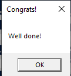

# CrackMe#1

## Objectives:
1. Find the serial key and enter in the textbox
2. Patch the file to always show the Congrats message when button Check is clicked

## Material:
- [Download crackme1.zip](https://github.com/paulchin/github-crackmes/blob/master/CrackMe1.zip)
- Password to unzip: crackinglessons.com

## Solution: 
Sau khi unzip, chúng ta có thể thấy có một file `CrackMe1.exe`. Chạy file này, chúng ta thấy yêu cầu nhập Serial Key:

Mình thử nhập một ký tự bất kì thì đây là kết quả:

Để tìm được serial key thì mình sẽ dùng **ida** và đọc pseudocode của chương trình.

Ở dòng 24, mình thấy có dòng so sánh `String` với `cr4kingL3ssons` và dựa vào kết quả đó để in ra output thông báo Serial key đúng hay sai. Nên mình nghĩ nó chính là Serial key chúng ta cần đi tìm.

Vậy là chúng ta đã tìm được Serial key. 

Yêu cầu tiếp theo, chúng ta phải vá chương trình để output luôn thông báo là mật khẩu đúng khi Check.

Trở lại với IDA View, mình bắt đầu từ dưới lên:

Đọc code asm, chúng ta có thể thấy điều kiện để hiển thị thông báo là so sánh eax với 0 (`test eax, eax`), nếu như eax khác 0 (`jnz short loc_401154`)thì sẽ thông báo là serial key sai. Vì thế serial key đúng khi eax bằng 0. 

Dựa vào đó, mình sẽ đi xem đâu là chỗ ảnh hưởng đến eax:

Hình ảnh trên cho thấy rằng eax có hai hướng bị ảnh hưởng: xóa dữ liệu của eax hoặc trừ có nhớ dữ liệu của eax rồi so sánh với 1. Như vậy thì để eax bằng 0, chúng ta cần điều hướng chương trình chạy vào hàm `loc_40112C`. 

Dựa vào đó, ta có thể thấy từ hàm `loc_401110`, chương trình đã có điều hướng sang hàm `loc_401130`. Mình sẽ tạo một breakpoint ở đây để debug.

Ở giao diện này, mình có thể theo dõi được ngay khi mình nhập sai, chương trình sẽ ngay lập tức chạy đến hàm `loc_401130`. Khi này giá trị của thanh eax đang là . Mình thử đi thêm một bước, giá trị của eax thay đổi thành , sau đó thì nó giữ nguyên. 

Mình đã nghĩ đến việc thay `or eax, 1` thành `xor eax, eax` nhưng rất tiếc nó không được vì nó bị thừa byte khiến chương trình bị lỗi.

Do đó, mình thay đổi hướng suy nghĩ bằng việc không để chương trình chạy đến `loc_401130`. Mình đã thay đổi asm tại break point để nó chuyển hướng như sau:

Và mình đã thành công chuyển hướng của nó. Sau đó, để chương trình chạy vào `loc_40112C`, mình tiếp tục thay đổi:

Khi này, mình nhập sai thì chương trình đã thành công thông báo Congrats. Tuy nhiên, nếu vá như vậy thì chỉ là đang biến việc nhập sai -> Congrats, còn nhập đúng -> Sorry. Do đó mình cần tiếp tục kiểm tra trường hợp nhập đúng Serial key.

Khi nhập đúng, eax của chúng ta đã mặc định là 0, và nếu như `or eax, 1` thì thanh eax sẽ khác 0, vì vậy mình thay thành `or eax, 0` và đã thành công vá chương trình với trường hợp nhập đúng Serial key.

## Answer:
> Serial key: `cr4kingL3ssons`

> Patching result:
>
>  
> 