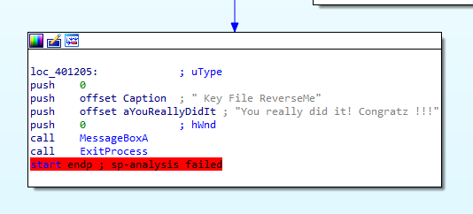
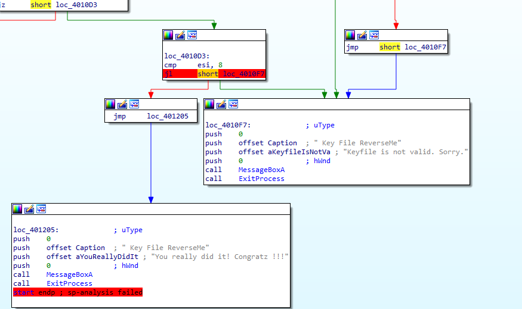
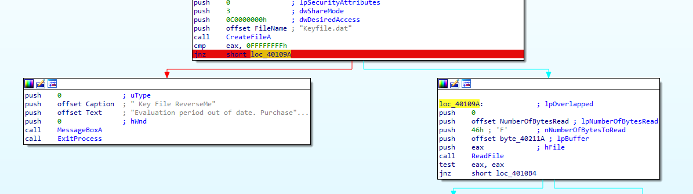
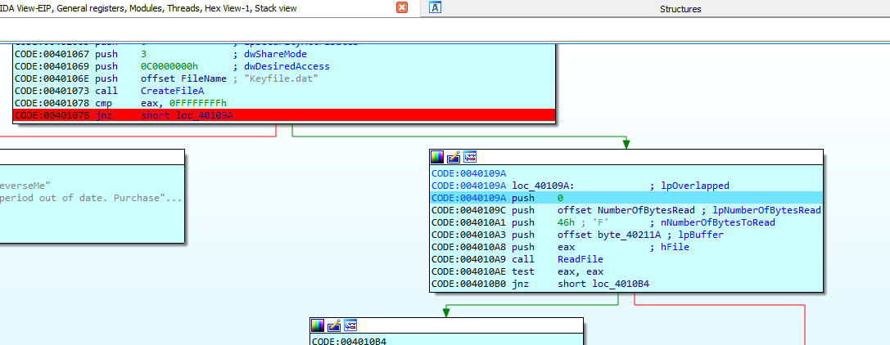
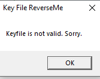
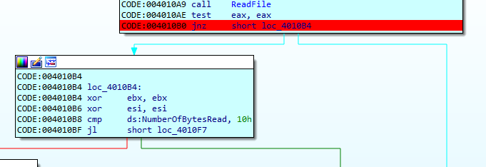
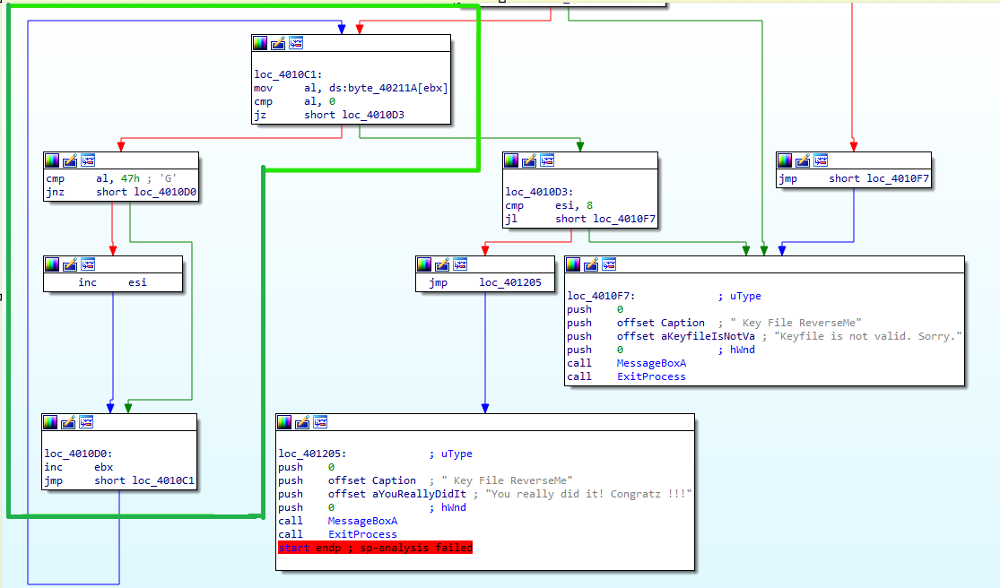
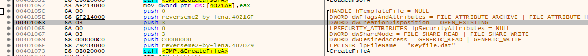
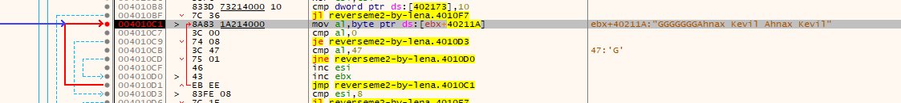
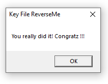

# CrackMe#10 - ReverseMe2 by Lena

## Objectives:
This reverseme is written by Lena and is one of the classic reverseme’s used to learn reversing. Use this in conjunction with xAnalyzer plugin for x64dbg to practice serial key fishing.

## Material:
- [Download crackme10.zip](https://github.com/paulchin/github-crackmes/blob/master/ReverseMe2-by-Lena.zip)
- Password to unzip: crackinglessons.com

## Solution:
Mở bài lên bằng IDA, do không đọc được pseudocode nên mình nhìn sơ qua về sơ đồ (IDA View-A) thì thấy bài toán có 3 cách output. Và có lẽ rằng mình cần có được cửa sổ: 



Dựa vào sơ đồ bài toán, mình lật ngược lại vấn đề, làm sao để có thể ra được cửa sổ đó. Thì mình thấy có một cơ sở so sánh ở đây:



Mình tạm note nó lại để tí nữa sẽ xem xét thêm. Quay ngược lại phần output còn lại: 



Ở đây cũng có một điều kiện so sánh, và có lẽ chỉ có 2 ngã rẽ cuộc đời này thôi. Trước tiên mình sẽ xem kỹ hơn về mấy dòng code này:

```
push offset FileName
call createFileA
cmp eax, 0FFFFFFFFh
jnz short loc_40109A
```

Đoạn code trên sẽ đưa dữ liệu trong biến `FileName` lên stack, sau đó `call createFileA` sẽ lấy tên trong stack đó để tạo file. Giá trị trả về của hàm `createFileA` sẽ trả về thanh ghi `eax`. `cmp eax, 0FFFFFFFFh` được dùng để kiểm tra xem quá trình tạo/ mở File có hoàn tất hay không. Nếu thành công (giá trị trong `eax` khác `0FFFFFFFFh`) thì chương trình sẽ chạy đến label `loc_40109A`. 

Đọc code hàm `createFileA` thì nhiệm vụ của nó là mở File đã tồn tại. Nhưng thực tế thì không có nên mình phải tự tạo File. 



Mình vào debug để kiểm tra và thấy mình đã hoàn thành việc điều hướng của chương trình. Tiếp theo mình sẽ xem xem nó làm gì :>>



Nhưng vì một lí do nào đó mà nó đã không đi qua break point mình đánh dấu mà thông báo luôn cửa sổ Keyfile is not valid. 



Mình đặt breakpoint tại một điểm trỏ thẳng tới cửa sổ thông báo này và phát hiện nguyên nhân là do câu lệnh `jl` có trong hình. 

```
cmp ds:NumberOfBytesRead, 10h
jl short loc_40107F
```

Đoạn code trên sẽ kiểm tra dữ liệu tcủa NumberOfBytesRead với `10h` tức `16d`, nếu như nhỏ hơn thì nhảy tới `short loc_40107F`. Vậy thì chúng ta chỉ cần chỉnh sửa dữ liệu cho lớn hơn 16 bytes. Mình sẽ thử và tiếp tục debug. 

Tuy nhiên chương trình của mình bị rơi vào một vòng lặp ở nhánh được khoanh trong hình.



Ở đây thì mình thấy chương trình sẽ lấy dữ liệu từ data của chúng ta (khi debug thì mình nhận ra) rồi move từng kí tự vào thanh ghi `al`. Sau đó nó sẽ so sánh từng kí tự đó với `0` (kí tự `NULL`). Mà kí tự này sẽ xuất hiện khi file không có kí tự nào/ kí tự cuối cùng của dữ liệu. Do đó, mình sẽ để chương trình chạy đến khi không còn dữ liệu. 

Tuy nhiên khi chạy sang nhánh có `loc_4010D3` thì do thanh ghi `esi` nhỏ hơn 8 nên chương trình thất bại. Do đó, mình cần tìm cách để tăng nó lên 8. Tiếp tục trở lại với nhánh được khoanh, mình thấy khi mà kí tự của trong file "Keyfile.dat" của mình là G thì chương trình sẽ tăng giá trị thanh ghi `esi` lên 1. 

Vì vậy, trong file chỉ cần có 8 kí tự G cùng 8 kí tự khác (để đủ 16 bytes) là chương trình sẽ hoàn tất. Mọi người có thể xáo trộn các kí tự cũng không ảnh hưởng tới kết quả chương trình.  

### xAnalyzer

Ở bài này, nếu sử dụng xAnalyzer, chúng ta có thể dễ dàng thấy luôn hàm createFileA sẽ làm nhiệm vụ gì (OPEN_EXISTING): 



Đồng thời, nếu sử dụng IDA thì cũng dễ dàng nhìn thấy được data được lưu ở `ebx+40211A`:


## Answer:
