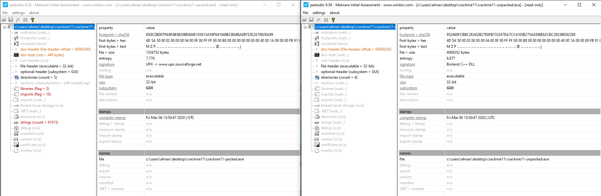
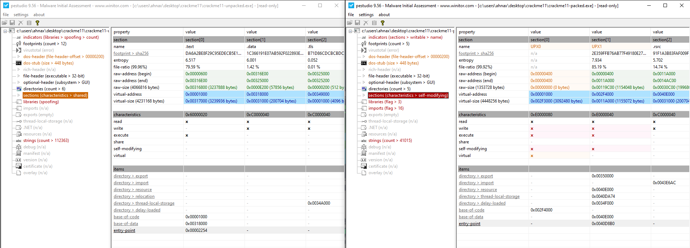
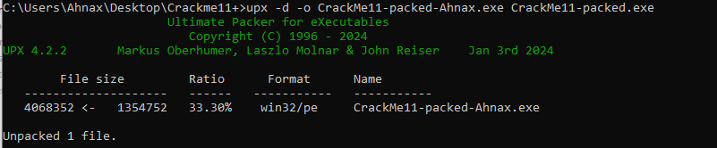
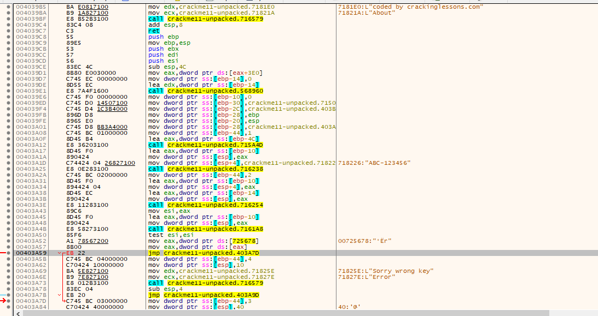
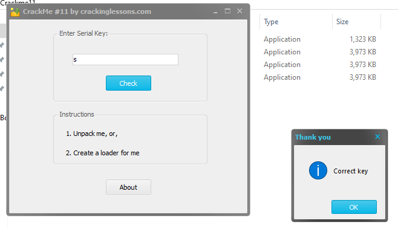

# CrackMe#11

## Discription:
This CrackMe is packed with UPX 3.91 packer. Your task is to :

1. Unpack it and then patch the unpacked file, or,
2. Create a loader for it

After unzipping you will find two files:

1. CrackMe11-packed.exe
2. CrackMe11-unpacked.exe

Use file 1 to practice unpacking & loader. File 2 is just for you to compare to see what is the difference like between a packed and unpacked file.

## Material:
- [Download crackme11.zip](https://github.com/paulchin/github-crackmes/blob/master/Crackme11.zip)
- Password to unzip: crackinglessons.com

## Solution:

Đề bài cho chúng ta 2 file để thực hành unpacking và nhìn ra sự khác biệt giữa packed và unpacked file. Vậy thì trước hết cùng đi tìm hiểu [packed](https://www.infosecinstitute.com/resources/malware-analysis/analyzing-packed-malware/) và unpacked file là gì?

Để phân tích rõ ràng, mình có đưa 2 file đề bài cho vào Pestudio và nhìn vào sự khác biệt đó:

Ngoài ra còn sự khác biệt ở entry point trong sections của 2 chương trình:

Trong khi kiểm tra ở Pestudio, thì mình thấy công cụ pack được sử dụng là UPX nên mọi người có thể sử dụng tool này để unpack:

Sau khi unpack mình sẽ thực hiện patch file, cũng chỉ đơn giản là sửa lệnh `je` thành `jump` (IDA không xem được sơ đồ nên mình sử dụng x32dbg để trace over tìm đến):

Bên cạnh cách unpack và patch này, còn có thể tạo loader cho file packed. Đây là định nghĩa mà mình thấy dễ hiểu nhất: "A loader is a software component in an operating system that loads executable programs or software modules into memory for execution by the CPU." Và đây là cách giải cho [tạo loader](https://elhacker.info/Cursos/Software%20Ethical%20Hacking%20-%20How%20to%20Crack%20Software%20Legally/29.%20Cracking%20software%20using%20loaders/2.1%20creating-a-loader.txt) mọi người có thể tham khảo.

## Answer:
