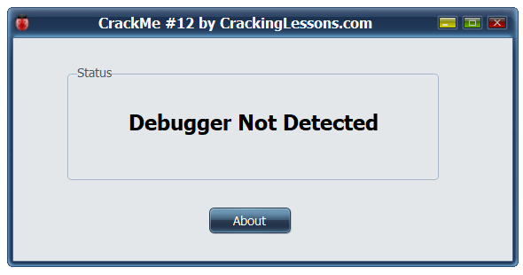
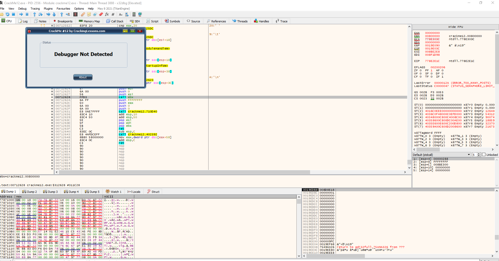

# CrackMe#12

## Discription:
This CrackMe has Anti-Debugging features. If you open it with a debugger and then run, it will detect the debugger and exit. Your task is to bypass the anti-debugging feature, so that the program will continue to run and show the window below:

## Material:
- [Download crackme12.zip](https://github.com/paulchin/github-crackmes/blob/master/CrackMe12.zip)
- Password to unzip: crackinglessons.com

## Solution:
Như đề bài đã mô tả thì chương trình của mình có [Anti-Debugging](https://www.apriorit.com/dev-blog/367-anti-reverse-engineering-protection-techniques-to-use-before-releasing-software#:~:text=To%20bypass%20anti-debugging%20protection%20based%20on,redefined%20before%20the%20heap%20flag%20check.&text=To%20bypass%20anti-debugging%20protection,the%20heap%20flag%20check.&text=anti-debugging%20protection%20based%20on,redefined%20before%20the%20heap), thì mình phải tìm cách để chương trình có thể debug dù có Anti-debug. Trong bài viết mình đính kèm, có đề cập đến hàm IsDebuggerPresent sẽ kiểm tra user có đang dùng Debugger hay không, nếu có sẽ dừng chương trình lại. Do vậy, mình sẽ tìm kiếm hàm này và đặt breakpoint trước khi nó tác động.

Tuy nhiên @@ mình không hiểu vì sao khi sử dụng debugger mà nó vẫn hiện là not detected :v 

## Answer:
