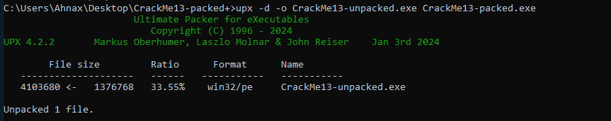
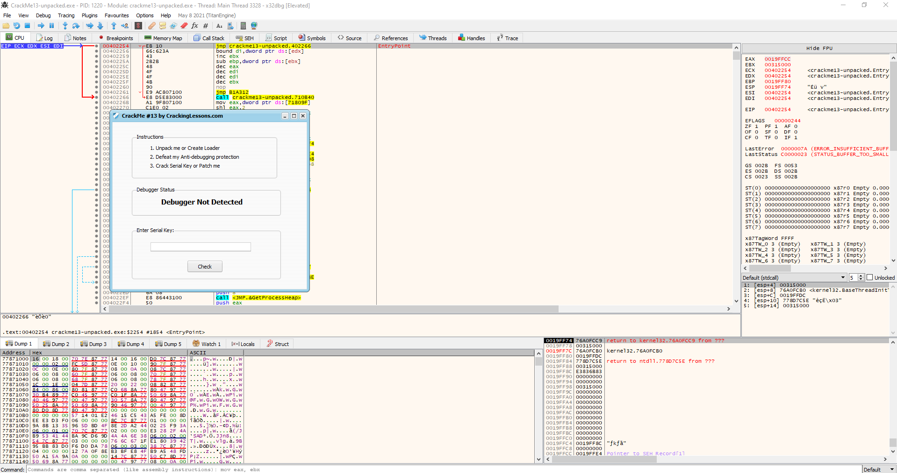
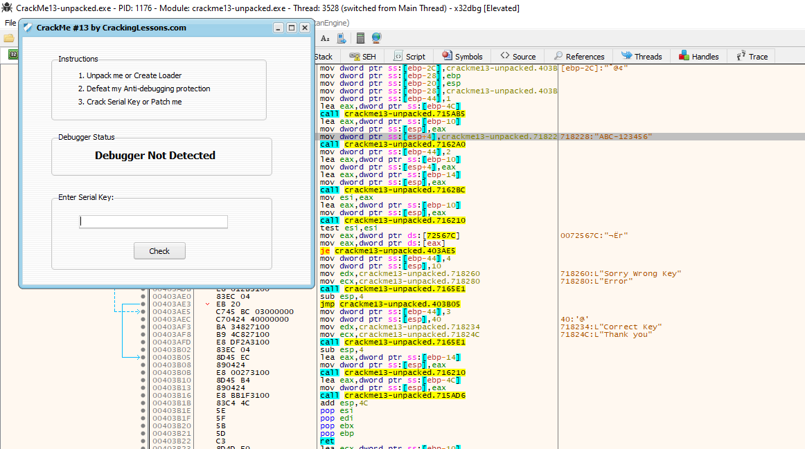
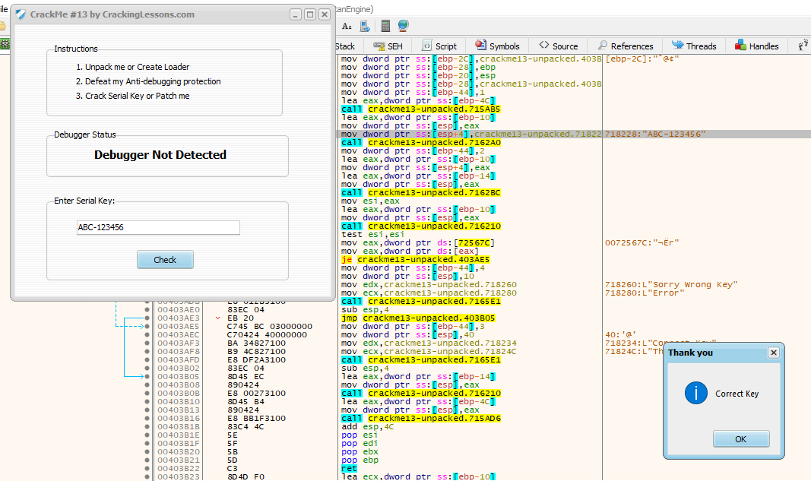

# CrackMe#13

## Discription:
This CrackMe combines three features:

1. Packing
2. Anti-Debugging
3. Software Serial Key Requirement

Your task is to:

1. Unpack it, or Create a Loader for it
2. Defeat the Anti-Debugging protection
3. Crack the Serial Key, or, Patch it

## Material:
- [Download crackme13.zip](https://github.com/paulchin/github-crackmes/blob/master/CrackMe13-packed.zip)
- Password to unzip: crackinglessons.com

## Solution:
Task 1: Unpack it, or Create a Loader for it

Task 2: Defeat the Anti-Debugging protection

> Không hiểu tại sao nhưng mấy con mal này nó k cho mình test anti-debugging sao vậy @@

Task 3; Crack the Serial Key, or, Patch it

Một là tìm Serial Key hai là vá chương trình :Đ

Mình thấy bài này là bài kết hợp của 3 bài phía trước, có lẽ bây giờ chúng ta sẽ gặp những file như thế này, tuy nhiên vì đã làm 3 bài kia nên vấn đề nó đã được giảm nhẹ :>

## Answer:
