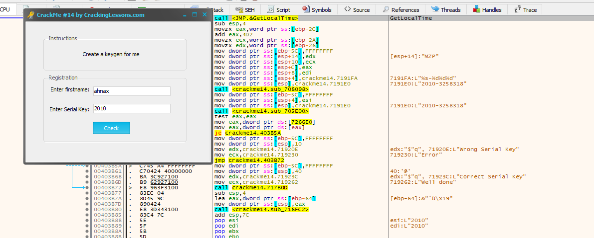
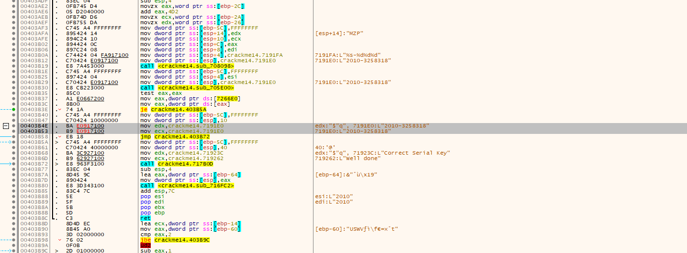
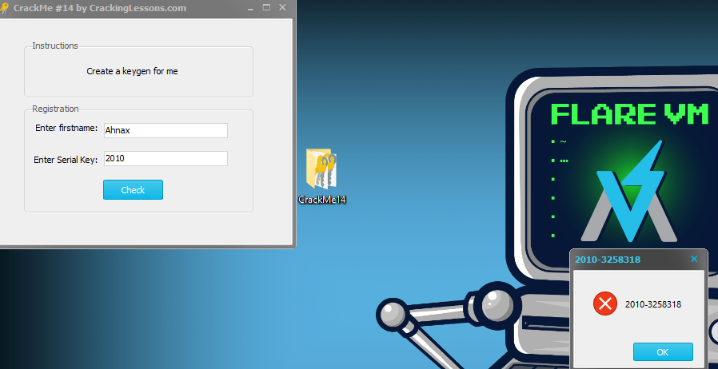

# CrackMe#14

## Discription:
This CrackMe asks for your firstname and then generates a Serial Key based on your firstname.

1. Create a Keygen that will be able to generate any Serial Key based on your firstname.
2. To solve this challenge, you may create a self-keygen or, write a separate keygen.

## Material:
- [Download crackme14.zip](https://github.com/paulchin/github-crackmes/blob/master/CrackMe14.zip)
- Password to unzip: crackinglessons.com

## Solution:
Mình sẽ trace over để tìm ra chỗ giải quyết vấn đề nha cả nhà iu của kem :v

Ở đây nha cả nhà, ở bài này, mình thấy key được gen và đưa vào stack `7191E0`, đề bài yêu cầu mình phải in ra được self-keygen. Vì thế, mình sẽ thay đổi địa chỉ mà mình muốn stack thông báo thôi:

## Answer:

