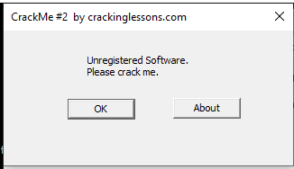
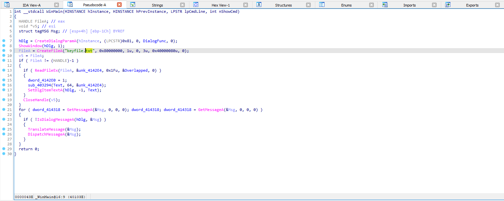
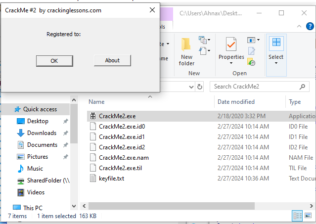
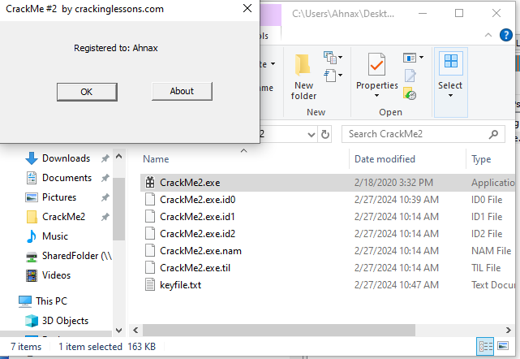

# CrackMe#2

## Objectives:
Without patching, Register it to your name.

## Material:
- [Download crackme2.zip](https://github.com/paulchin/github-crackmes/blob/master/CrackMe2.zip)
- Password to unzip: crackinglessons.com

## Solution: 
Unzip và chạy chương trình, ta thấy cửa sổ này xuất hiện:

Vậy là bằng một cách nào đó, không vá chương trình, chúng ta vẫn có thể "register". Mình đọc pseudocode của chương trình:

Ở dòng số 9, mình thấy có tương tác với file _**keyfile.txt**_, tiếp sau đó là có sự so sánh giữa `FileA` và `v5` rồi sau đó đọc dữ liệu của FileA ra. Có nghĩa là, nếu như không có sự tương tác của keyfile thì sẽ không xảy ra những đoạn code bên dưới.

Thế nên, mình đã tạo thêm một file txt ở bên ngoài để xem có vấn đề gì.

Sau khi thêm, mình đã thành công thay đổi cửa sổ output. Nhưng có lẽ vẫn chưa đúng với yêu cầu đề bài (Register it to **your name**). Mình thử viết tên của mình vào `keyfile.txt` và mình đã crack thành công chương trình.

## Answer:
Result: 