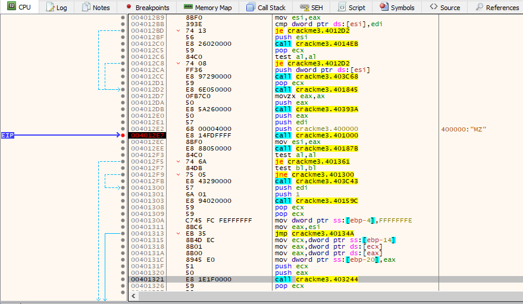
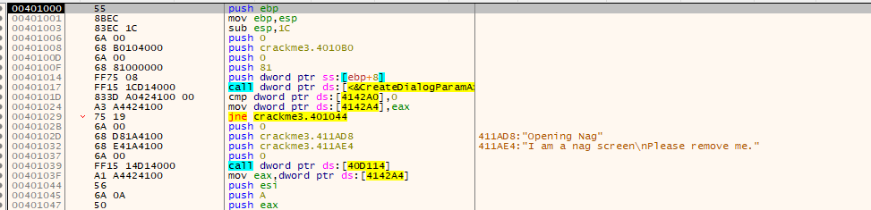
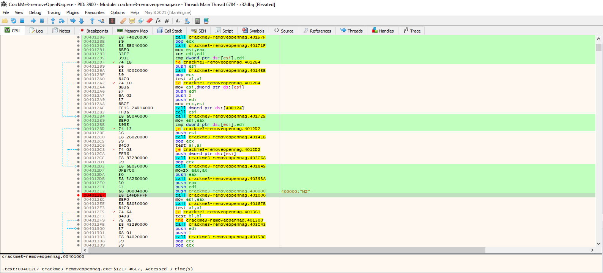
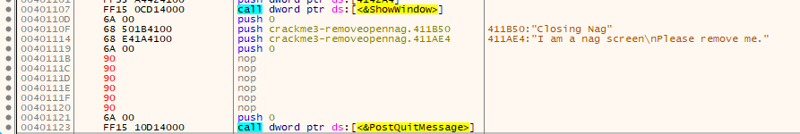
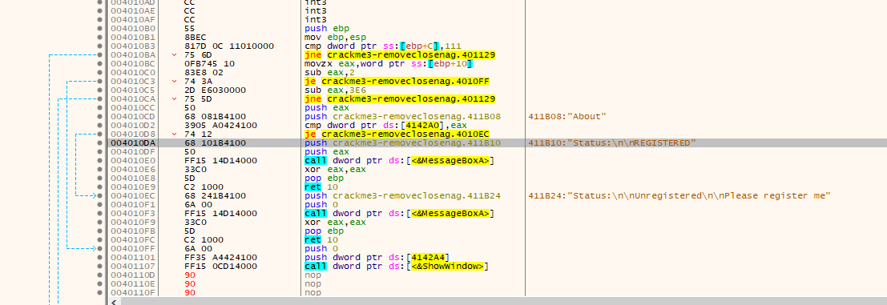
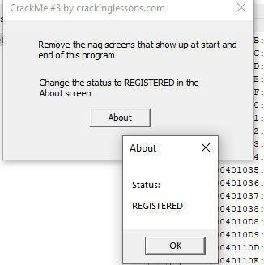

# CrackMe#3

## Objectives:
1. Remove the 2 nag screens – one at startup and one at close of program.
2. In the About screen – change status to Registered.

## Material:
- [Download crackme3.zip](https://github.com/cspinstructor/github-crackmes/blob/master/CrackMe3.zip)
- Password to unzip: crackinglessons.com

## Solution: 
Mình đã thử thay đổi những câu lệnh jump để điều hướng chương trình, nhưng nó có vẻ đã xảy ra lỗi mà mình không hiểu vì sao. Do đó, mình nghĩ đến việc thay đổi những câu lệnh của nag screens để nó không bị ảnh hưởng đến chương trình chính.

Trước tiên là xóa nag screen. Mình xóa open nag screen trước. Mình sử dụng "animation over" để duyệt qua tất cả các hàm được gọi mà không đi sâu vào các câu lệnh của nó. Khi chương trình chạy đến hàm nag open screen thì nó dừng lại. Mình đặt một breakpoints rồi đi sâu vào hàm này để xử lý:

Mình thấy một dòng lệnh `call dword ptr ds:[40D114]` là mở màn hình nag, vậy nên mình sẽ thay nó bằng NOP để nó không thực hiện gì.

Và mình đã hoàn thành việc xóa open nag screen. Mình patch file và tiếp tục xóa close nag screen.

Mở file đã xóa open nag screen, mình tiếp tục "animation over" để tìm kiếm hàm mở close nag screen rồi set breakpoint:

Mình tìm kiếm câu lệnh mở close nag screen và thay thế bằng lệnh nop. 

*Mình đã thử trước bằng IDA cách này nhưng chương trình có vẻ bị ảnh hưởng gì đó @@ mình cũng chưa hiểu được tại sao.*

Sau khi xóa được các nag screen, mình tiến hành việc thay đổi status của about thành registered.

Tại dòng mà mình bôi xám, đó là trạng thái REGISTERED mà ctrinh đã có sẵn. Nhiệm vụ của mình là chuyển hướng ctrinh chạy cửa sổ đó (cái này có thể thực hiện bằng **IDA**). Nhưng mình đang sử dụng **x32debug** nên mình sẽ thay dòng lệnh `je` thành nop để nó không chuyển hướng mà chạy thẳng vào câu lệnh thông báo REGISTERED.

Cuối cùng là patch file và lưu nó lại. Vậy là mình đã hoàn thành các nhiệm vụ của CrackMe#3

## Answer:
Result:
