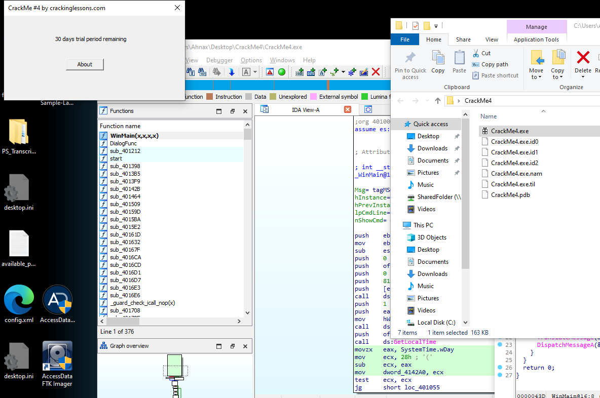

# CrackMe#4

## Objectives:
1. Crack it to extend beyond 30 days
2. In the About screen – also extend it to beyond 30 days

## Material:
- [Download crackme4.zip](https://github.com/paulchin/github-crackmes/blob/master/CrackMe4.zip)
- Password to unzip: crackinglessons.com

## Solution: 
Đọc đoạn pseudocode của chương trình, mình thấy số ngày còn lại nó là `30 - SystemTime.wDay`:

Mình thấy toán hạng thứ 2 là toán hạng không thay đổi được, vậy nên mình nghĩ đến việc thay đổi toán hạng đầu tiên (số 30) vì có lẽ nó đã được lưu trong một register nào đó:

Đúng như mình đoán, nó được lưu trong thanh ghi ecx, vì vậy để thay đổi đối số này, mình sẽ sửa giá trị trước khi nó truyền vào ecx. 

Nhiệm vụ của mình bây giờ là tính toán xem làm sao để nó hiển thị là 30 days: thay đổi 1Eh thành 28h.

Và mình đã thành công :3 Kéo theo đó là About screen cũng đã được thay đổi.

## Answer:

