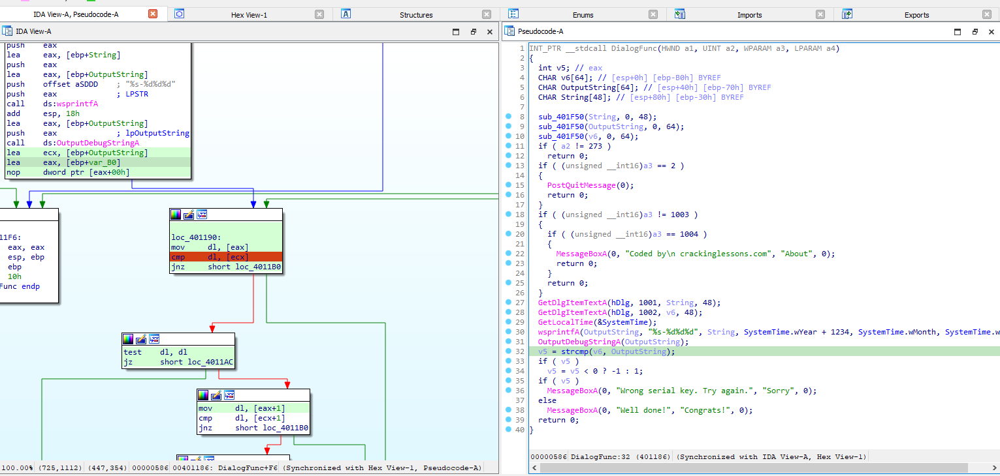
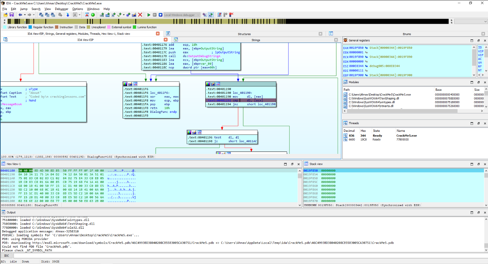
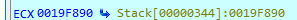
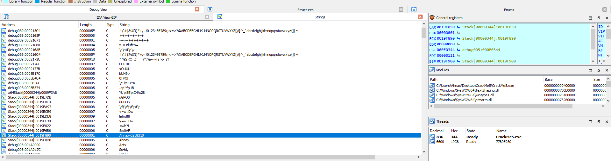
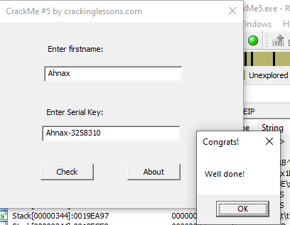

# CrackMe#5

## Objectives:
1. Enter your first name.
2. Crack the software to find a valid serial key for your firstname

## Material:
- [Download crackme5.zip](https://github.com/paulchin/github-crackmes/blob/master/CrackMe5.zip)
- Password to unzip: crackinglessons.com

## Solution: 
Đọc pseudocode của chương trình, mình thấy được đoạn code hiển thị Serial Key đúng hay sai dựa vào điều kiện compare OutputString và biến v6, thiết nghĩ đây là Key mình nhập vào và Serial Key chuẩn, nên mình xem assembly code của nó để tìm được Serial Key của mình. 

Khi đã tìm được thì mình để breakpoint ở đó để tiện tìm ra Serial Key của mình. Sau đó thì mình debug thôi:

Sau khi nhập tên thì chương trình của mình dừng lại và trên cửa sổ **General Registers** có hiển thị thanh **ecx** đang chứa dữ liệu ở stack . 

Nhiệm vụ của mình là tìm đến nó:

## Answer:

