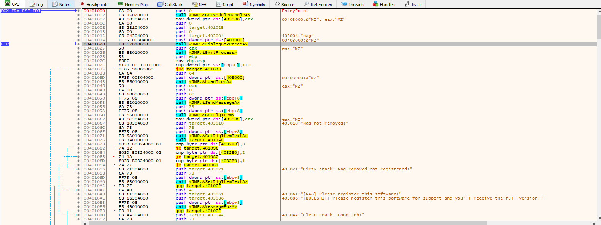
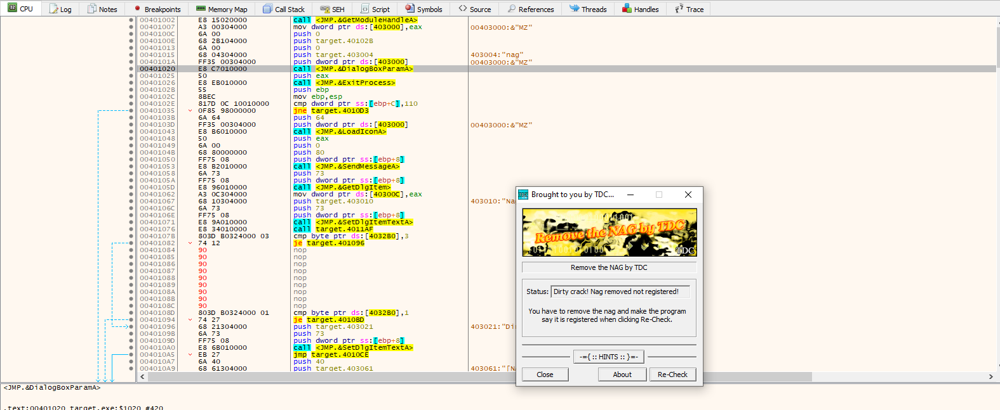
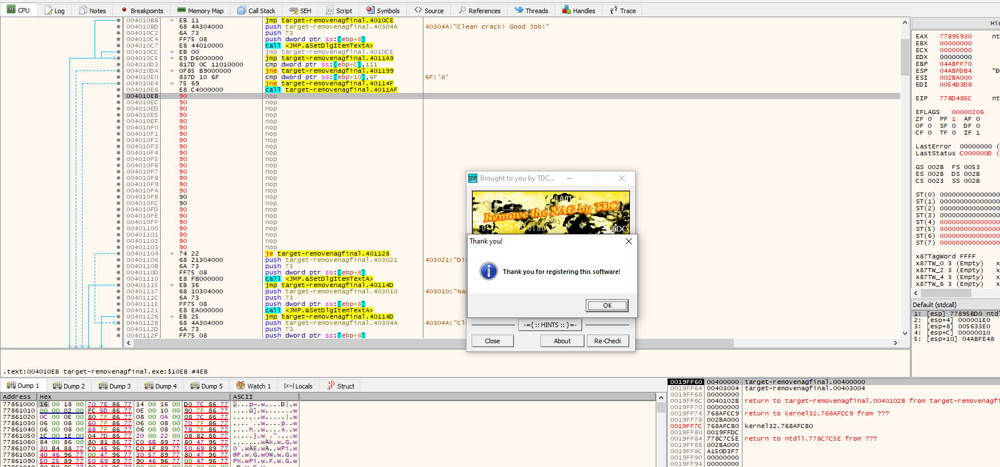
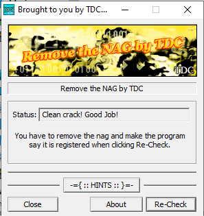

# CrackMe#6
# #6 Target by TDC

## Objectives:
1. Remove the starting Nag Screen
2. When the button Re-Check is clicked, a pop-up messagebox appears and you should set it to say “Thank you for registering this software”
3. Set the Status box text to: “Clean crack! Good Job!”

## Material:
- [Download crackme6.zip](https://github.com/paulchin/github-crackmes/blob/master/Target.zip)
- Password to unzip: crackinglessons.com

## Solution: 
Nhiệm vụ đầu tiên là xóa Nag Screen. Mình xem _Animation Over_ và nhìn thấy ctrinh mở nag screen và dừng lại đợi thao tác của mình: 

Ở đây, mình nhìn thấy các câu lệnh jump có điều kiện, vậy để nó không hiện ra stastus "Nag not remove" và cửa sổ Nag thì mình bắt buộc phải cho nó jump đến chỗ mình muốn (tức là không để điều kiện so sánh mà jump thẳng luôn đến địa chỉ mình muốn). Vì vậy mình sẽ thay những dòng code không cần thiết thành NOP:

Tiếp theo, mình cần sửa pop-up messagebox. Theo dõi đoạn code vừa trên, mình thấy đoạn code bên dưới là màn hình có thể hiện thị ra pop-up. Vì thế, mình sử dụng thao tác như trên (xóa các câu lệnh không cần thiết để jump thẳng đến vị trí cần thiết):

Cuối cùng, mình cần phải thay đổi Status box text thành "Clean crack". Cái này có vẻ cũng giống với trên kia thôi :v

## Answer:

