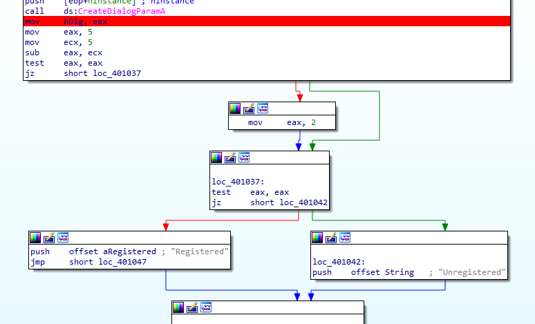
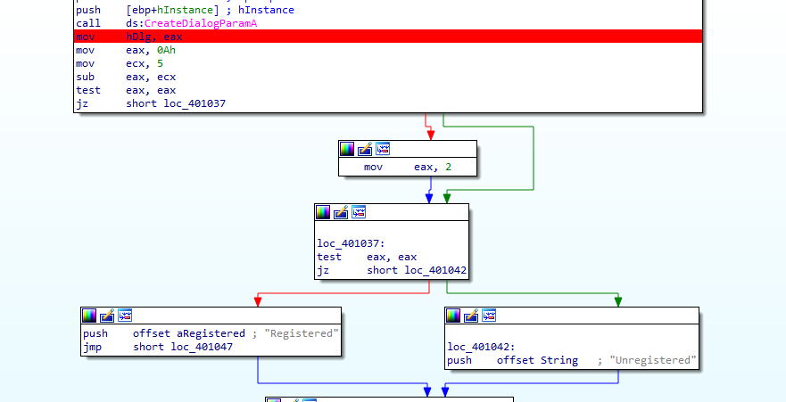
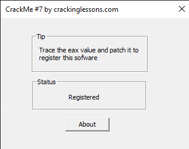

# CrackMe#7

## Objectives:
This CrackMe teaches a specific method of cracking which is to trace the eax value and patch it.

## Material:
- [Download crackme7.zip](https://github.com/paulchin/github-crackmes/blob/master/CrackMe7.zip)
- Password to unzip: crackinglessons.com

## Solution:
Ở đây đề ài yêu cầu mình phải thay đổi giá trị của thanh ghi eax để vá chương trình. Mình nhận thấy thanh ghi eax được thay đổi từ ngay đầu chương trình. Nên mình đặt break point ở đó và theo dõi sự thay đổi:

Nhưng trước khi debug, mình nhìn thấy đoạn code trước khi `jz` có mục đích là để thanh ghi eax về 0 (do eax=5, ecx=5 mà trừ đi thì =0) sau đó nó sẽ nhảy vào `loc_401037` rồi nhảy sang ô thông báo **Unregisted**. Vậy thì để chuyện này không xảy ra, mình sẽ không để thanh ghi eax của mình được gán là 5 nữa. Mình để một giá trị bất kì:

## Answer:
