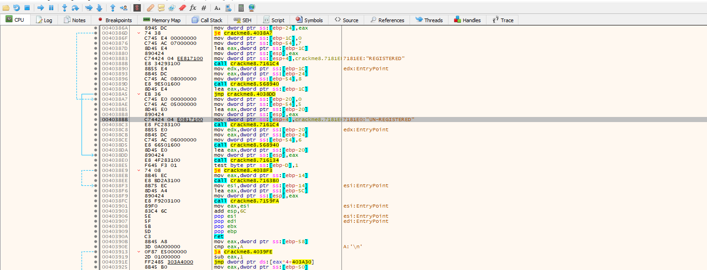
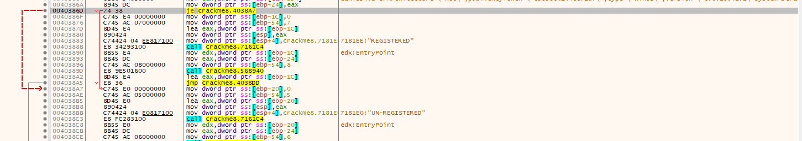
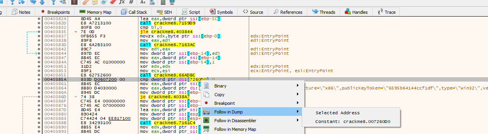
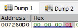
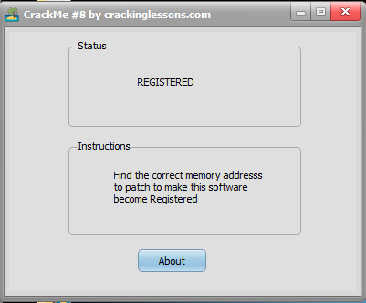

# CrackMe#8

## Objectives:
This crackme is for learning how to put hardware breakpoints on memory addresses and then patch it to register the program.

## Material:
- [Download crackme8.zip](https://github.com/paulchin/github-crackmes/blob/master/CrackMe8.zip)
- Password to unzip: crackinglessons.com

## Solution:
Mình không biết tại sao nhưng mình không dùng được IDA, vì vậy mình sẽ dùng x32dbg.

Mình tìm kiếm trong String "REGISTERED" và tìm đến vị trí của "UN-REGISTERED":

Qua đó, mình thấy một câu lệnh nhảy tới địa chỉ của câu lệnh này: 

Vì mục đích của bài tập này không phải thay đổi assemble nên mình không thể thay đổi `je` mà phải tìm vị trí của code so sánh và chỉnh sửa trong memory address của nó:

Ở dòng bôi xám, mình nhìn thấy nó đang so sánh giá trị trong ô nhớ `7260D0` với 0, nếu bằng 0 thì sẽ nhảy đến UNREGISTERED. Vì thế mình sẽ sửa giá trị ở đây thành giá trị khác 0 (mọi người có thể thay bit tùy thích nhé, miễn là nó vẫn ở vị trí đó. Ở đây, mình thay từ 0->1):

## Answer:
