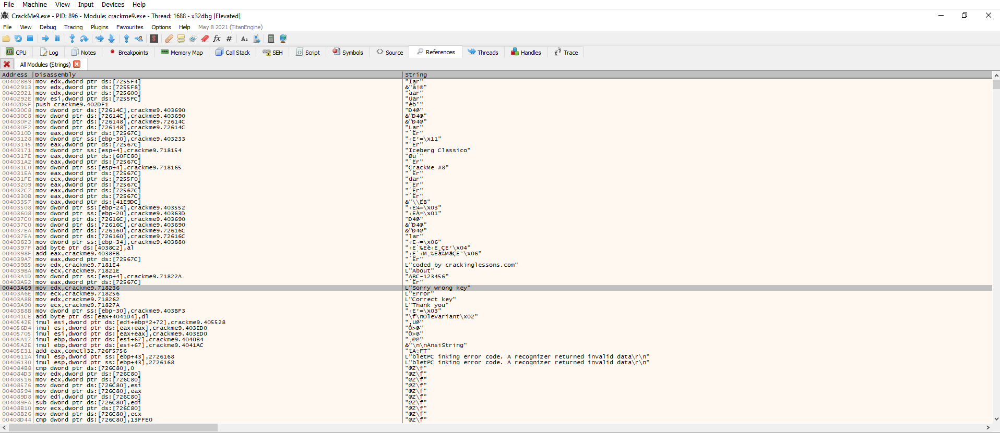
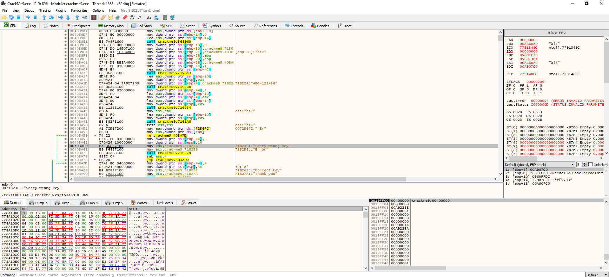
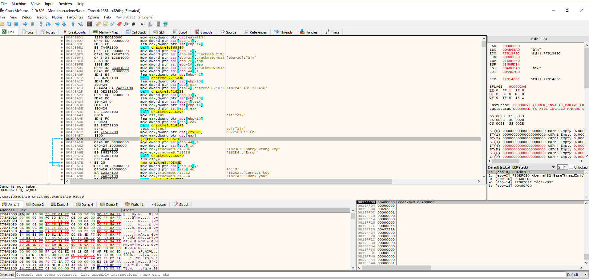
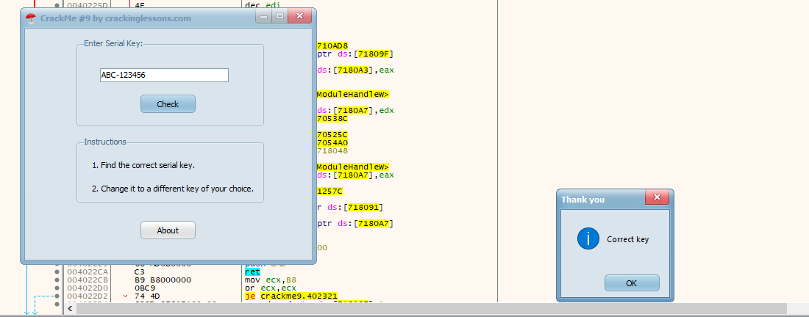
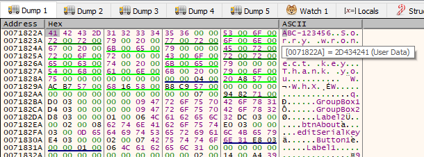
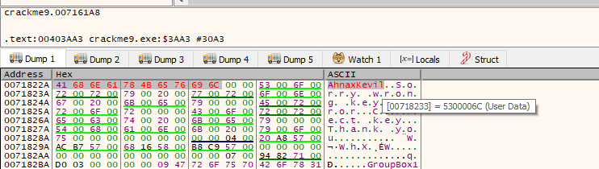
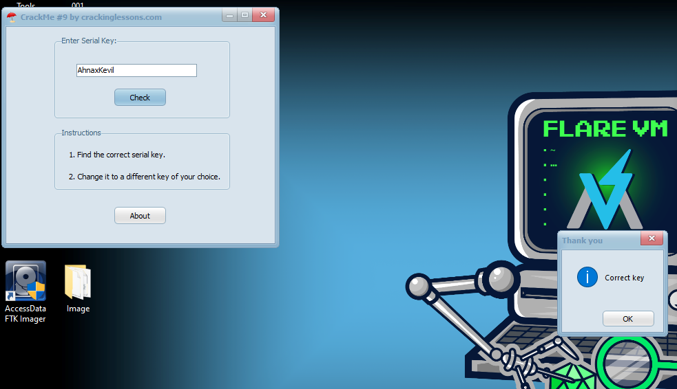

# CrackMe#9

## Objectives:
1. Find the correct serial key
2. Change it to a different key of your choice

## Material:
- [Download crackme9.zip](https://github.com/paulchin/github-crackmes/blob/master/CrackMe9.zip)
- Password to unzip: crackinglessons.com

## Solution:

Ở bài này mình sử dụng IDA và không tìm được hàm main/ function chính của nó nên mình bắt buộc phải sử dụng x32dbg. 

Mình run thử chương trình thì thấy nhập sai nó sẽ thông báo "Sorry Wrong Key". Thì theo mình, chương trình sẽ so sánh với key đúng rồi jump có điều kiện. 

Vì vậy mình tìm "Sorry Wrong Key" trong **String Reference** của **All Module**:

Rồi sau đó lộn ngược lại về code asm để tìm key:

Mình đã tìm thấy câu lệnh jump có điều kiện và kiểm tra điều kiện để nó thông báo key đúng là gì:

Ở đây mình đọc code thấy khá rối và có nhìn thấy một string đáng chú ý: "ABC-123456". Quá bất lực :( nên mình đã test xem nó có phải Serial Key không. 

Đúng rồi, vì thế nên mình sẽ chuyển sang nhiệm vụ thứ 2 - thay đổi thành key khác mà mình muốn.

Để hoàn thành thì mình cần thay đổi khi mà chương trình ghi string key lại => Mình cần thay trong dump:

Tại đây, mình thay thành key mình muốn ở data ASCII:

Mình đã sửa nó và cần test lại key.

## Answer:

